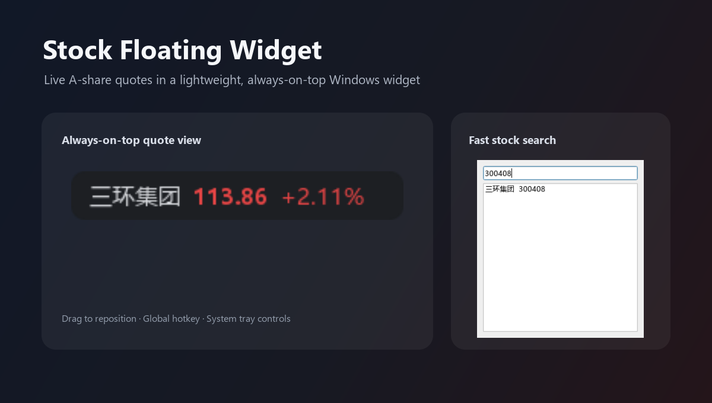
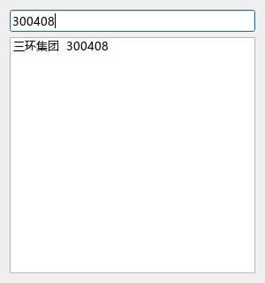

# Stock Floating Widget

[简体中文](#简体中文) | [English](#english)

一款面向个人投资工作流的轻量级 Windows 桌面股票价格悬浮窗。

A lightweight Windows desktop stock price floating widget for personal investment workflow.



## 简体中文

### 项目简介

Stock Floating Widget（股票悬浮窗）是一款轻量级 Windows 桌面工具，用于在桌面上持续显示所选 A 股股票的名称、最新价格和涨跌幅。窗口小巧、无边框并保持置顶，可以在工作时快速查看行情，同时尽量减少对其他应用的遮挡。

### 主要功能

- 显示股票名称、当前价格和涨跌幅。
- 遵循 A 股习惯，价格上涨显示红色，价格下跌显示绿色。
- 提供无边框、始终置顶的桌面悬浮窗。
- 支持拖动窗口，并记住上次关闭时的位置。
- 支持按股票名称、拼音或股票代码搜索 A 股。
- 自动刷新行情，也可以随时暂停更新。
- 网络请求失败时保留最近一次成功获取的行情。
- 提供 Windows 系统托盘菜单，可显示、隐藏、更换股票、暂停更新或退出程序。
- 支持 Windows 全局快捷键 `Alt+\`` 显示或隐藏悬浮窗。
- 自动在本地保存股票选择、刷新间隔、窗口位置和界面设置。

### 使用技术

- Python 3.10+
- [PySide6](https://doc.qt.io/qtforpython-6/) 桌面界面框架
- [Requests](https://requests.readthedocs.io/) 网络请求库
- 通过 Python `ctypes` 调用 Windows `RegisterHotKey` API
- 腾讯股票行情与股票搜索接口

### 安装方法

1. 安装 Python 3.10 或更高版本。Windows 安装 Python 时建议勾选 **Add Python to PATH**。
2. 克隆或下载本仓库。
3. 在项目目录中打开 PowerShell 或终端。
4. 建议创建并启用虚拟环境：

   ```powershell
   python -m venv .venv
   .\.venv\Scripts\Activate.ps1
   ```

5. 安装项目依赖：

   ```powershell
   python -m pip install -r requirements.txt
   ```

### 运行方法

在项目根目录运行现有入口文件：

```powershell
python main.py
```

首次启动时，悬浮窗会出现在屏幕右上角附近。可以直接拖动窗口调整位置，右键单击悬浮窗查看更多操作，也可以通过系统托盘图标管理程序。

### 基本使用

- 右键单击悬浮窗或使用系统托盘菜单更换股票。
- 在搜索窗口中输入股票名称、拼音或代码，然后选择目标股票。
- 拖动悬浮窗可调整位置，程序会自动保存最后的位置。
- 使用全局快捷键 `Alt+\`` 快速显示或隐藏悬浮窗。
- 行情默认自动刷新；需要时可通过菜单暂停或恢复更新。

### 本地配置

程序首次运行后会在以下位置创建本地配置文件：

```text
%APPDATA%\StockWidget\config.json
```

该文件用于保存所选股票、刷新间隔、窗口位置、字体大小、透明度、颜色和快捷键。它属于本机运行数据，不会上传到仓库。

### 注意事项

- 本项目主要面向 Windows；悬浮窗在其他平台上可能可以运行，但全局快捷键功能仅适用于 Windows。
- 股票行情需要联网获取，数据来自腾讯相关接口。
- 当前实现无需 API Key、账号或密码。
- 截图中的行情数据仅为截取时的示例，可能与当前实时行情不同。

## English

### Introduction

Stock Floating Widget displays a compact, always-on-top view of a selected A-share stock. It is designed to stay unobtrusive while you work and provide quick access to the latest price and percentage change.

### Features

- Displays the stock name, current price, and percentage change.
- Uses red for price increases and green for price decreases.
- Provides a borderless, always-on-top floating window.
- Supports drag-to-move and remembers the last window position.
- Searches stocks by name, pinyin, or stock code.
- Refreshes quote data automatically and supports pausing updates.
- Keeps the last successful quote visible when a network request fails.
- Includes a Windows system tray menu for showing, hiding, changing the stock, pausing updates, and quitting.
- Supports the global `Alt+\`` shortcut on Windows to show or hide the widget.
- Stores preferences locally between runs.

### Technology

- Python 3.10+
- [PySide6](https://doc.qt.io/qtforpython-6/)
- [Requests](https://requests.readthedocs.io/)
- Windows `RegisterHotKey` API through Python `ctypes`
- Tencent quote and stock-search endpoints

### Installation

1. Install Python 3.10 or later. On Windows, enable **Add Python to PATH** during installation.
2. Clone or download this repository.
3. Open a terminal in the project directory.
4. Optional but recommended: create and activate a virtual environment.

   ```powershell
   python -m venv .venv
   .\.venv\Scripts\Activate.ps1
   ```

5. Install the dependencies.

   ```powershell
   python -m pip install -r requirements.txt
   ```

### Running the Application

Run the existing entry point from the project root:

```powershell
python main.py
```

The widget appears near the upper-right corner on first launch. Drag it to reposition it, right-click it for more actions, or use the system tray menu.

### Configuration

The application creates its local configuration after the first run at:

```text
%APPDATA%\StockWidget\config.json
```

This file stores the selected stock, refresh interval, window position, font size, opacity, colors, and hotkey. It is local runtime data and is not part of the repository.

### Notes

- The application is intended primarily for Windows. The floating window can run on other platforms, but the global hotkey is Windows-specific.
- Quote data requires an internet connection and is retrieved from Tencent endpoints.
- No API key or account credentials are required by the current implementation.

## 项目结构 / Project Structure

```text
Stock-Floating-Widget/
|-- assets/
|   `-- screenshots/
|       |-- floating-widget.png
|       |-- product-overview.png
|       `-- stock-picker.png
|-- config/
|   |-- __init__.py
|   `-- settings.py
|-- services/
|   |-- __init__.py
|   `-- stock_api.py
|-- ui/
|   |-- __init__.py
|   |-- floating_window.py
|   `-- stock_picker.py
|-- utils/
|   |-- __init__.py
|   `-- win_hotkey.py
|-- .gitignore
|-- main.py
|-- README.md
`-- requirements.txt
```

## 产品截图 / Screenshots

### 股票行情悬浮窗 / Floating Quote Widget

悬浮窗会以紧凑形式显示所选股票的名称、当前价格和涨跌幅，不影响其他应用的正常使用。

The compact floating view shows the selected stock name, current price, and percentage change while staying out of the way of other applications.


### 股票搜索 / Stock Search

可以通过股票名称、拼音或股票代码搜索并选择 A 股股票。

Search for an A-share stock by name, pinyin, or stock code and select it from the result list.



截图中的行情数据仅为截取时的示例，可能与当前实时行情不同。

Market values shown in the screenshots are capture-time examples and may differ from current quotes.
